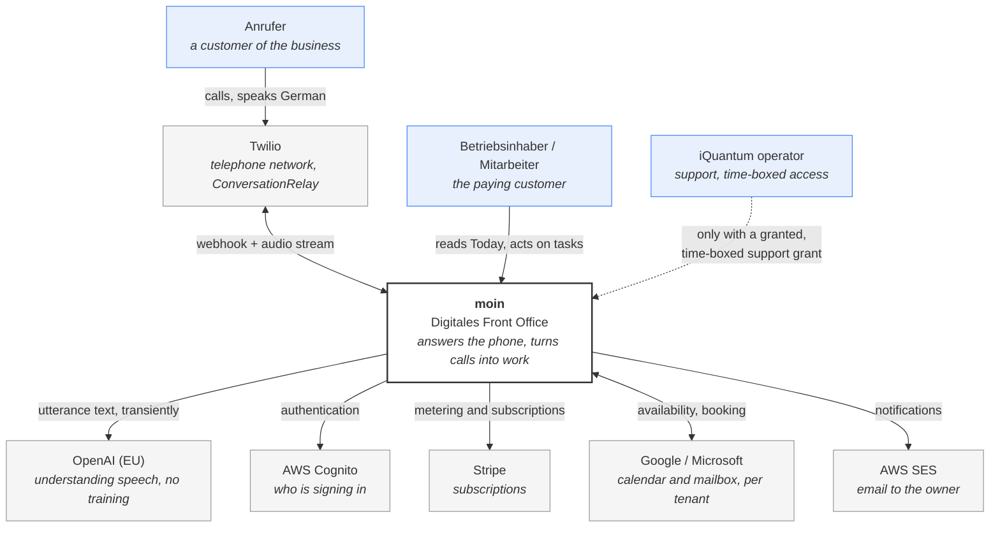
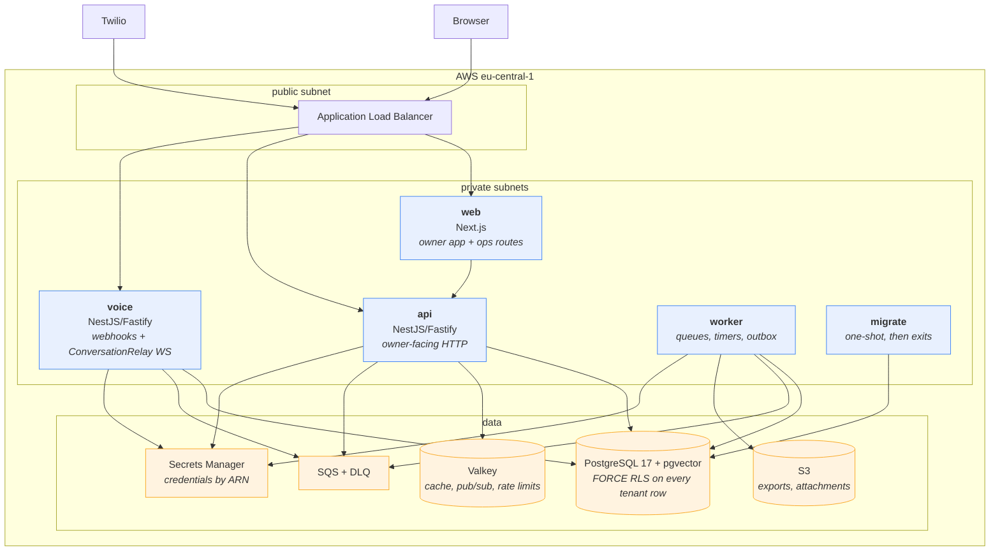

# C4 — system context and containers

Two levels. Component diagrams are deliberately absent: at this size they would restate the module
list in `domain-model.md` and then rot, because nothing regenerates them.

## Level 1 — system context

Who and what the system talks to, and why.

**The caller never touches the product directly.** They ring a telephone number. That is the whole
proposition: the customer's customer does not have to learn anything, install anything or consent
to anything beyond the disclosure they hear (INV-03).

**The operator arrow is dotted** because it does not exist by default. An operator sees tenant data
only through a grant the customer gives, which is time-boxed and audited (ADR-0037).

## Level 2 — containers

**All five containers are the same image**, started with a different command (INV-17). The boxes
differ by module graph and by scaling policy, not by artefact.

**`voice` is separated from `api` for failure reasons, not scale.** A voice session is a long-lived
WebSocket with hard deadlines; a deploy that interrupts one drops a call a human is on (INV-19).
Separating them lets voice drain on its own schedule.

**`migrate` runs to completion and exits.** It is the only role permitted to run DDL, so an
application-level SQL injection cannot alter the schema (ADR-0003).

**Nothing in the data row is reachable from the internet.** The load balancer terminates in the
public subnet; everything else is private.
