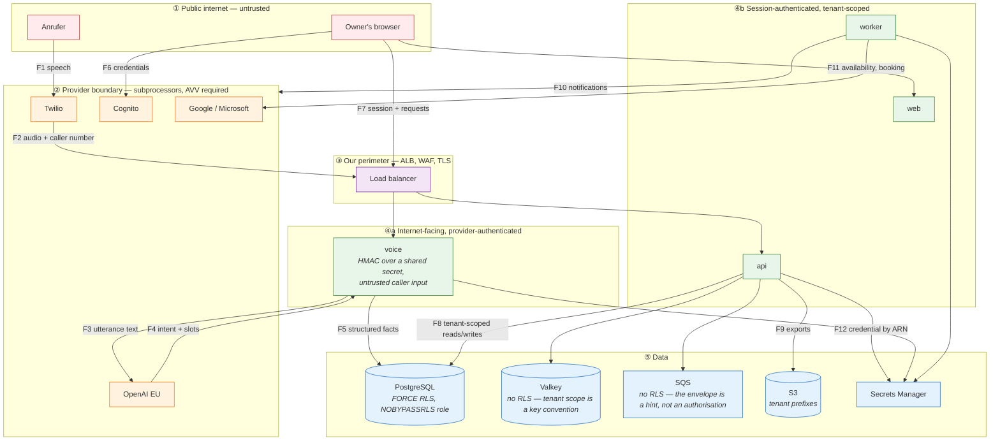

# Data-flow diagram with trust boundaries

Where personal data crosses a boundary, and what guards each crossing. This is the input to the
TOMs, the DPIA and the subprocessor register, so every flow here maps to an inventory category —
enforced by a script, because a diagram drifts from reality the moment it stops being checked.

## Trust boundaries

## Flows

| #       | Flow                        | Personal data                              | Inventory category                                 | Guard at the boundary                                                                                                                                                                                                          |
| ------- | --------------------------- | ------------------------------------------ | -------------------------------------------------- | ------------------------------------------------------------------------------------------------------------------------------------------------------------------------------------------------------------------------------ |
| **F1**  | Caller speaks               | Voice, anything they say                   | Call audio                                         | AI disclosure before the session (INV-03); the caller may hang up                                                                                                                                                              |
| **F2**  | Twilio → `voice`            | Caller number, audio stream                | Call metadata                                      | `X-Twilio-Signature` validated on every webhook; TLS; **audio is never written to disk** (INV-07)                                                                                                                              |
| **F3**  | `voice` → OpenAI            | Utterance text, transiently                | Transient STT                                      | EU project; no-training headers; no identifiers sent with it; not persisted by us                                                                                                                                              |
| **F4**  | OpenAI → `voice`            | Intent and slots                           | Structured fact                                    | Schema-validated; a parse failure re-asks rather than guessing                                                                                                                                                                 |
| **F5**  | `voice` → PostgreSQL        | Name, callback number, request ≤ 200 chars | Structured fact                                    | `withTenant`; FORCE RLS; the request field is capped so it cannot become a transcript                                                                                                                                          |
| **F6**  | Browser → Cognito           | Credentials, MFA                           | Account                                            | **The credential** never touches our servers. The authorization code, `state`, nonce and token validation do, in `api` — an earlier draft said "never touches our servers", which removed the callback from the model entirely |
| **F7**  | Browser → ALB → `api`       | Session, request bodies                    | Account, Contact, Task                             | TLS; server-side session lookup, revocable; tenant derived server-side (INV-02)                                                                                                                                                |
| **F8**  | `api` ↔ PostgreSQL          | Everything tenant-scoped                   | Contact, Task, Lead, Appointment, Knowledge, Audit | `withTenant` only; FORCE RLS; `NOBYPASSRLS` role owning no tables                                                                                                                                                              |
| **F9**  | `api` → S3                  | Export contents                            | Contact, Task                                      | Per-tenant prefix; presigned, short-lived URLs; cross-tenant prefix test                                                                                                                                                       |
| **F10** | `worker` → SES/SMS/push     | Owner contact, task titles                 | Account, Task                                      | Notification payloads carry **identifiers and a template id**, never conversation content (INV-12)                                                                                                                             |
| **F11** | `worker` ↔ Google/Microsoft | Availability, appointment details          | Appointment                                        | Tenant-granted OAuth; credential resolved from Secrets Manager by ARN at use                                                                                                                                                   |
| **F12** | `api` → Secrets Manager     | — (it _is_ the credential)                 | Credential — not personal data                     | Resolved at use, cached in memory with a TTL, **never written to disk or a log** (INV-15)                                                                                                                                      |

## The crossings worth arguing about

**F3 — utterance text to a model provider.** This is the flow a data-protection review will look at
hardest: a German consumer's speech, as text, leaving our perimeter. Three things bound it. The
text is sent without identifiers, so the provider receives an utterance and not a person. The EU
project and no-training headers bound what may be done with it. And **we do not persist what comes
back beyond the template-defined facts** (ADR-0019) — so the corpus that would make this worrying
never accumulates on our side.

It remains a genuine transfer to a subprocessor and is listed as one. **EXT-12 must be in place
before any real caller reaches it.**

**F2 — audio in transit.** Audio crosses the provider boundary and our perimeter, and is never
written. The assertion is in the voice path and is tested (INV-07). This is the single strongest
privacy property the product has, and it is worth stating that it is a _design_ property: there is
no configuration that turns recording on.

**F10 — notifications.** The tempting design puts the caller's request in the push notification, so
the owner sees it on a lock screen. That would put personal data through Apple, Google and an SMS
carrier, on a device that may not be the owner's. Notifications carry a template id and an
identifier; the content is fetched by the app after authentication.

## Verification

| Enforcement                                                       | Where                                                          |
| ----------------------------------------------------------------- | -------------------------------------------------------------- |
| Every flow maps to an inventory category and a subprocessor entry | `scripts/check-dfd-coverage.ts` (P03.04.03)                    |
| Webhook signatures validated                                      | `packages/telephony` signature test with a forged signature    |
| No audio written                                                  | Storage assertion in the voice path (INV-07)                   |
| Tenant derived server-side                                        | No route reads an organisation id from a request body (INV-02) |
| Notification payloads carry no content                            | Schema test on notification payloads (INV-12)                  |
| S3 prefixes are tenant-scoped                                     | Cross-tenant prefix test in the isolation suite                |
